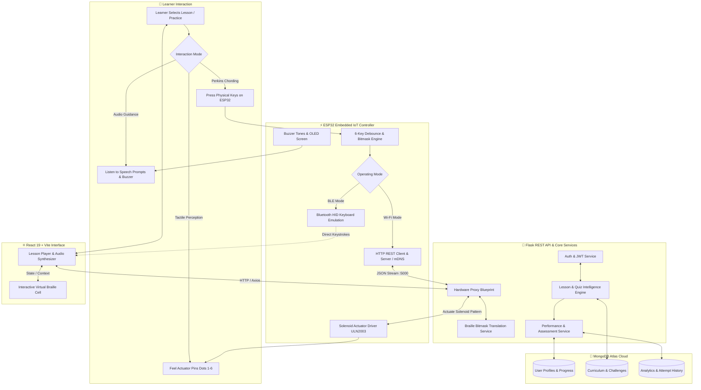

<div align="center">

⠃⠗⠁⠊⠇⠇⠑⠺⠊⠎⠑


<br/>


<br/><br/>

[](https://github.com/veereshska15/BrailleWise)
[](https://github.com/veereshska15/BrailleWise)
[](https://github.com/veereshska15/BrailleWise)
[](https://espressif.com)
[](https://mongodb.com)

<br/>

[](https://python.org)
[](https://flask.palletsprojects.com/)
[](https://react.dev)
[](https://vitejs.dev/)
[](https://isocpp.org/)
[](https://opensource.org/licenses/MIT)

### *Next-Generation Assistive Braille Learning & Tactile IoT Ecosystem*

<p align="center">
  <a href="#-key-features"><b>Key Features</b></a> •
  <a href="#-overview"><b>Overview</b></a> •
  <a href="#-interactive-system-flowchart"><b>Flowchart</b></a> •
  <a href="#-system-architecture"><b>Architecture</b></a> •
  <a href="#-technology-stack"><b>Tech Stack</b></a> •
  <a href="#-hardware-specifications--schematics"><b>Hardware</b></a> •
  <a href="#-quickstart-guide"><b>Quickstart</b></a> •
  <a href="#-rest-api-reference"><b>REST API</b></a> •
  <a href="#-author--connect-with-me"><b>Contact</b></a>
</p>

</div>

---

## 🌟 Key Features

| Feature | Description |
| :--- | :--- |
| 🖐️ **Tactile Solenoid Cell** | Real-time physical actuation of 6-dot Braille cells using electromagnetic push-pull solenoids / micro-servos for authentic tactile learning. |
| ⌨️ **Perkins Chording Input** | 6-key multi-touch Perkins keyboard with debounce handling and chord-to-character bitmask decoding for Dots 1–6 plus Space, Backspace, and Enter. |
| 🌐 **Zero-Config mDNS** | Automatic local domain resolution through `http://braillewise.local`, removing the need for manual ESP32 IP discovery. |
| 📶 **Dual Operation Modes** | Switch seamlessly between **Wi-Fi REST Mode** for web lesson synchronization and **Bluetooth Low Energy (BLE)** for wireless HID keyboard input. |
| 🎙️ **Multi-Modal Audio Guidance** | Spoken step-by-step feedback, letter phonetics, and audio buzzer cues support learners through tactile exercises. |
| 📚 **Adaptive Learning Pathways** | Structured lessons for English Braille alphabet, numbers, punctuation, contractions, and interactive practice challenges. |
| 📊 **Real-Time Analytics & Scoring** | MongoDB-backed tracking for response time, accuracy, mastery milestones, progress, and error trends. |

---

## 📖 Overview

BrailleWise is designed around **four accessible interaction channels**:

| Interaction Channel | BrailleWise Experience |
| :--- | :--- |
| 🖐️ **Touch** | Physical Braille dots rise and fall through tactile actuators in sync with lessons. |
| ⌨️ **Input** | Users enter characters through a physical Perkins-style chording keyboard. |
| 🔊 **Audio** | Spoken speech synthesis guidance and buzzer feedback reinforce tactile learning. |
| 💻 **Digital** | React lessons, practice activities, quizzes, and analytics provide the visual and learning layer. |

> The platform bridges software and embedded hardware so that learning content can be experienced through **touch, sound, and physical interaction** rather than relying solely on a visual screen.

---

## 🔄 Interactive System Flowchart



---

## 🏗 System Architecture

BrailleWise employs a tripartite architecture linking the web interface, application services, and physical embedded controllers:

```text
+-------------------------------------------------------------------------+
|                       CLIENT TIER (React 19 + Vite)                     |
|  - Interactive Lesson Player         - Perkins Virtual Keypad           |
|  - Audio / Speech Guidance Engine     - Hardware Settings (mDNS Bridge)  |
+------------------------------------+------------------------------------+
                                     |
                                     | HTTP REST / JSON (Port 5000)
                                     v
+-------------------------------------------------------------------------+
|                     BACKEND API TIER (Flask + Python 3.13)              |
|  - Authentication & JWT Sessions     - Hardware Communication Proxy     |
|  - Dynamic Lesson / Quiz Engine      - Braille Bitmask Translation      |
|  - MongoDB Atlas Cloud Persistence   - Active Device Registry           |
+------------------------------------+------------------------------------+
                                     |
                 +-------------------+-------------------+
                 | (Wi-Fi REST / mDNS)                   | (BLE HID Mode)
                 v                                       v
+----------------------------------+   +----------------------------------+
|     ESP32 REST WEB SERVER        |   |    BLUETOOTH LOW ENERGY (BLE)    |
|  Host: http://braillewise.local  |   |    "BrailleWise Keyboard" HID    |
|  Endpoints:                      |   |    - Types decoded chords        |
|    - POST /set-pattern           |   |      directly into laptop input  |
|    - GET  /read-buttons          |   |      fields as standard keyboard |
+----------------+-----------------+   +----------------+-----------------+
                 |                                      |
                 +------------------+-------------------+
                                    |
                                    v
+-------------------------------------------------------------------------+
|                        PHYSICAL EMBEDDED HARDWARE                       |
|  [6x Actuator Solenoids]   [6x Perkins Push Buttons]   [Action Keys]    |
|  [Active Piezo Buzzer]     [SSD1306 0.96" OLED]        [Mode Switch]    |
+-------------------------------------------------------------------------+
```

---

## 🛠 Technology Stack

### Programming Languages & Frameworks

| Domain | Technology | Purpose | Badge |
| :--- | :--- | :--- | :--- |
| **Frontend UI** | React 19 | Declarative UI, state management, component tree |  |
| **Frontend Tooling** | Vite 6 | Lightning-fast HMR and bundle compilation |  |
| **Backend Framework** | Flask 3.0 | Lightweight RESTful microservice API |  |
| **Backend Language** | Python 3.13 | High-performance application backend |  |
| **Microcontroller** | C++ / Arduino Core | ESP32 low-latency firmware & hardware interrupts |  |
| **Database** | MongoDB Atlas | NoSQL document storage for users & analytics |  |
| **Styling** | Vanilla CSS3 | Custom high-contrast, accessible UI design system |  |
| **Accessibility** | Web Speech API | Client-side audio speech prompt synthesis |  |
| **Wireless Protocol** | BLE & mDNS | Wireless keyboard HID & zero-config IP discovery |  |

---

## 🔌 Hardware Specifications & Schematics

### Bill of Materials (BOM)

| Component | Specification | Quantity | Purpose |
| :--- | :--- | :---: | :--- |
| **Microcontroller** | ESP32 WROOM-32 Dev Module | 1 | Dual-core CPU, Wi-Fi 802.11 b/g/n, BLE 4.2 |
| **Tactile Solenoids** | 5V Push-Pull Electromagnetic Actuators | 6 | Raises and lowers physical Braille cell dots 1–6 |
| **Motor Driver** | ULN2003 / Darlington Transistor Module | 1 | Current amplification for driving solenoids |
| **Perkins Buttons** | Tactile Momentary Push Switches | 6 | Chording input keys (Dots 1 to 6) |
| **Action Keys** | Tactile Momentary Push Switches | 3 | Space, Backspace, and Enter / Submit keys |
| **Mode Switch** | SPST Slider or Toggle Switch | 1 | Switch between Wi-Fi Server and BLE Keyboard mode |
| **Piezo Buzzer** | 5V Active Buzzer Module | 1 | Audio feedback for chords, errors, and prompts |
| **OLED Display** | 0.96" I2C SSD1306 ($128 \times 64$) *(Optional)* | 1 | Visual feedback, IP display, active letter monitor |
| **Power Source** | 5V 2A DC Adapter or USB Port | 1 | Stable voltage supply for solenoids & ESP32 |

---

### Circuit Schematics & Pinout

```text
                           +---------------------------------------+
                           |             ESP32 WROOM               |
                           +---------------------------------------+
   Dot 1 Push Button  ---> | GPIO 32 (In, Pullup)                  |
   Dot 2 Push Button  ---> | GPIO 33 (In, Pullup)                  |
   Dot 3 Push Button  ---> | GPIO 05 (In, Pullup)                  |
   Dot 4 Push Button  ---> | GPIO 18 (In, Pullup)                  |
   Dot 5 Push Button  ---> | GPIO 19 (In, Pullup)                  |
   Dot 6 Push Button  ---> | GPIO 15 (In, Pullup)                  |
                           |                                       |
   Space Action Key   ---> | GPIO 04 (In, Pullup)                  |
   Backspace Key      ---> | GPIO 16 (In, Pullup)                  |
   Enter / Submit Key ---> | GPIO 17 (In, Pullup)                  |
   Mode Toggle Switch ---> | GPIO 35 (Input Only)                  |
                           |                                       |
   Solenoid Dot 1 M1A <--- | GPIO 04 (Output)                      |
   Solenoid Dot 2 M1B <--- | GPIO 16 (Output)                      |
   Solenoid Dot 3 M2A <--- | GPIO 17 (Output)                      |
   Solenoid Dot 4 M2B <--- | GPIO 18 (Output)                      |
   Solenoid Dot 5 M3A <--- | GPIO 19 (Output)                      |
   Solenoid Dot 6 M3B <--- | GPIO 23 (Output)                      |
                           |                                       |
   Audio Buzzer Signal<--- | GPIO 23 (Output)                      |
   OLED Display SDA   <--- | GPIO 21 (I2C SDA)                     |
   OLED Display SCL   <--- | GPIO 22 (I2C SCL)                     |
                           +---------------------------------------+
```

> **Engineering Note**: Dot 6 button is mapped to **GPIO 15** (instead of GPIO 21) to prevent pin contention with the I2C OLED display line on **GPIO 21 (SDA)**.

---

## 🚀 Quickstart Guide

### 1. Prerequisites

* **Python**: 3.10 to 3.13 installed
* **Node.js**: 18+ and npm installed
* **Arduino CLI** or **Arduino IDE** (with `esp32:esp32` board core v3.x)
* **MongoDB**: Local MongoDB community instance or free MongoDB Atlas cluster

---

### 2. Backend Setup

```bash
# 1. Clone the repository
git clone https://github.com/veereshska15/BrailleWise.git
cd BrailleWise/backend

# 2. Create and activate a Python virtual environment
python -m venv venv
# On Windows:
.\venv\Scripts\activate
# On Linux/macOS:
source venv/bin/activate

# 3. Install required Python packages
pip install -r requirements.txt

# 4. Configure environment variables (or copy template)
cp ../.env.example ../.env

# 5. Launch the Flask API server
python app.py
```
* Backend will be live at: **`http://127.0.0.1:5000`**

---

### 3. Frontend Setup

```bash
cd ../frontend

# 1. Install frontend dependencies
npm install

# 2. Start the Vite development server
npm run dev
```
* Frontend will be live at: **`http://localhost:5173`**

---

### 4. ESP32 Hardware Firmware Setup

1. Open `backend/hardware/esp32_braille_device/esp32_braille_device.ino` in Arduino IDE or compile via Arduino CLI.
2. Ensure the partition scheme is set to **Huge APP (3MB No OTA / 1MB SPIFFS)**:
   ```bash
   arduino-cli compile --fqbn esp32:esp32:esp32:PartitionScheme=huge_app backend/hardware/esp32_braille_device
   ```
3. Connect your ESP32 via USB and upload:
   ```bash
   arduino-cli upload -p COM5 --fqbn esp32:esp32:esp32:PartitionScheme=huge_app backend/hardware/esp32_braille_device
   ```
4. In your browser, navigate to [http://localhost:5173/settings](http://localhost:5173/settings) and click **Test Connection**.

---

## 📡 REST API Reference

### Hardware IoT Endpoints (`/api/hardware`)

| Method | Endpoint | Description | Payload Example |
| :--- | :--- | :--- | :--- |
| `POST` | `/api/hardware/esp32/set-pattern` | Actuate physical 6-dot solenoid cell | `{"dots": [1, 0, 1, 0, 0, 1], "ip": "braillewise.local"}` |
| `GET` | `/api/hardware/esp32/read-buttons` | Poll states of 6 physical Perkins keys | `?ip=braillewise.local` |
| `POST` | `/api/hardware/input` | Ingest stream from ESP32 chording engine | `{"device_id": "esp32_01", "character": "b", "dots_mask": 3}` |
| `GET` | `/api/hardware/pattern/<char>` | Get binary mask and dot indices for letter | *None* |
| `GET` | `/api/hardware/status` | Retrieve status of connected devices | *None* |

### Core Learning & Assessment Endpoints

| Method | Endpoint | Description |
| :--- | :--- | :--- |
| `POST` | `/api/auth/register` | Register new student or educator profile |
| `POST` | `/api/auth/login` | Authenticate and obtain JWT bearer token |
| `GET` | `/api/lessons` | Retrieve all structured Braille curriculum modules |
| `GET` | `/api/lessons/<id>` | Fetch step-by-step interactive lesson exercises |
| `POST` | `/api/assessments/submit` | Record quiz attempt, compute accuracy, and persist score |
| `GET` | `/api/dashboard/stats` | Aggregate user progress, streak days, and mastery badges |

---

## 📂 Repository Structure

```text
BrailleWise/
├── .env.example                     # Environment template configuration
├── .gitignore                       # Production git exclusion rules
├── LICENSE                          # MIT open-source license
├── README.md                        # Master project documentation
├── backend/
│   ├── app.py                       # Application factory & Blueprint loader
│   ├── config.py                    # MongoDB & JWT configuration
│   ├── database.py                  # PyMongo client & collection bindings
│   ├── requirements.txt             # Python package dependencies
│   ├── hardware/                    # Embedded microcode & schematics
│   │   ├── esp32_braille_device/    # Complete client, mDNS, & BLE firmware
│   │   ├── esp32_solenoid_server.ino# Lightweight REST server
│   │   └── pi_braille_keyboard.py   # Raspberry Pi USB HID controller
│   ├── models/                      # MongoDB schema & data abstractions
│   ├── routes/                      # REST API blueprints
│   └── services/                    # Business logic & translation layers
├── frontend/
│   ├── index.html                   # HTML entrypoint
│   ├── package.json                 # Node scripts & dependencies
│   ├── vite.config.js               # Vite bundler configuration
│   └── src/
│       ├── components/              # Reusable UI components
│       ├── pages/                   # Lesson Player, Quiz, Settings, Dashboard
│       └── utils/
│           └── hardwareBridge.js    # Direct React-to-ESP32 client bridge
└── docs/
    └── hardware_setup.md            # In-depth electronic wiring manual
```

---

## 🤝 Contributing

Contributions are welcome! Please follow these steps:

1. Fork the repository (`git fork`).
2. Create your feature branch (`git checkout -b feature/BrailleEnhancement`).
3. Commit your changes (`git commit -m "Add new feature"`).
4. Push to the branch (`git push origin feature/BrailleEnhancement`).
5. Open a Pull Request.

---

## 📄 License

This project is licensed under the **MIT License** — see the [LICENSE](LICENSE) file for details.

---

## 👤 Author & Connect With Me

<div align="center">

### **VEERESH S**
*AIML Engineering Student • AI/ML Developer • BrailleWise Creator*

<br/>

<p align="center">
  <a href="https://veeresh-portofoli0.vercel.app/" target="_blank">
    
  </a>
  &nbsp;
  <a href="https://www.linkedin.com/in/iamveereshs14/" target="_blank">
    
  </a>
  &nbsp;
  <a href="https://www.leetcode.com/veereshska15" target="_blank">
    
  </a>
  &nbsp;
  <a href="https://github.com/veereshska15" target="_blank">
    
  </a>
  &nbsp;
  <a href="mailto:veereshveeru565750@gmail.com">
    
  </a>
</p>

<br/>

| Profile Field | Details |
| :--- | :--- |
| 🎓 **USN** | `4SF23CI184` |
| 🏛 **Institution** | **Sahyadri College of Engineering and Management, Mangalore** |
| 💻 **Specialization** | Artificial Intelligence & Machine Learning (AIML) |
| 💼 **LinkedIn** | [linkedin.com/in/iamveereshs14](https://www.linkedin.com/in/iamveereshs14/) |
| 🐙 **GitHub** | [@veereshska15](https://github.com/veereshska15) |
| 🧩 **LeetCode** | [leetcode.com/veereshska15](https://www.leetcode.com/veereshska15) |
| 🌐 **Portfolio** | [veeresh-portofoli0.vercel.app](https://veeresh-portofoli0.vercel.app/) |
| 📧 **Email** | [veereshveeru565750@gmail.com](mailto:veereshveeru565750@gmail.com) |

<br/>

> 💬 **Any Enquiries?**  
> For project discussions, research collaborations, internships, technical queries, or feedback, feel free to reach out through any of the channels above!

</div>

<br/>

<div align="center">


⠃⠗⠁⠊⠇⠇⠑⠺⠊⠎⠑  
### **Feel • Hear • Learn**
*Built with ❤️ for accessible education and digital inclusion.*

</div>
